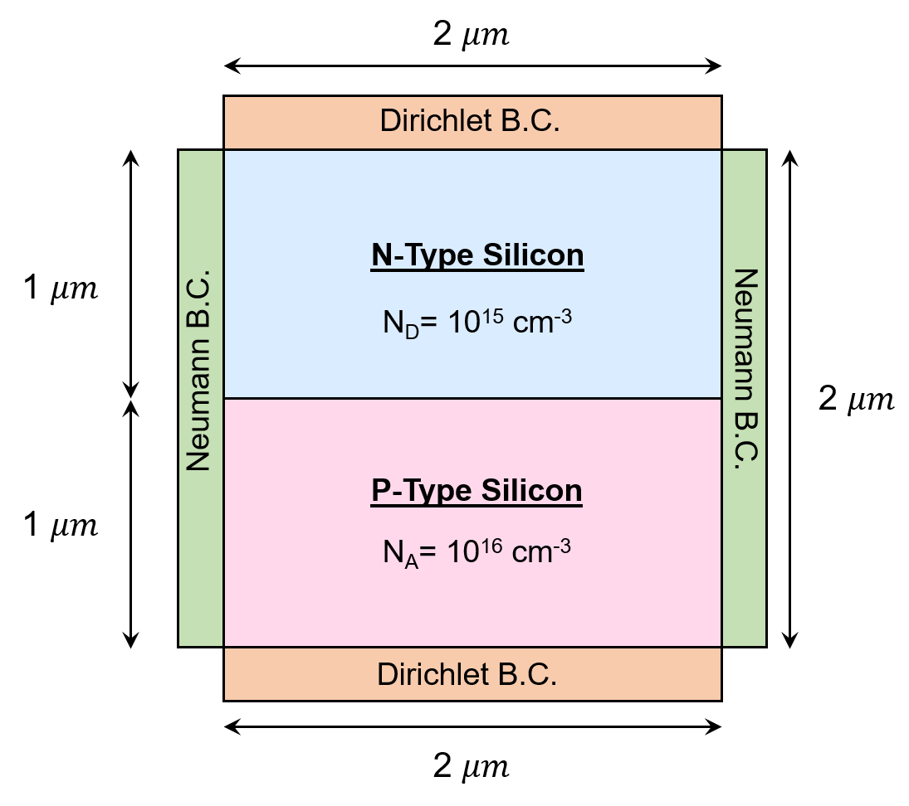
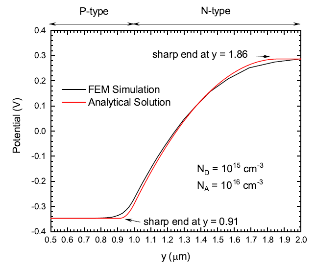
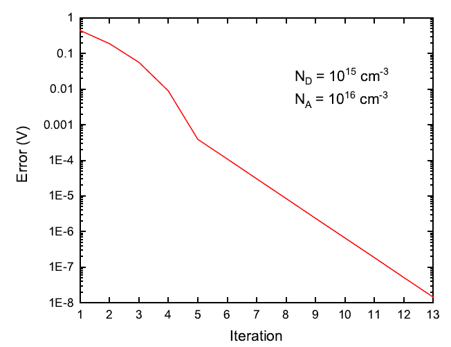

# Computational Electromagnetics: A Nonlinear Poisson FEM Solver Implemented by Newton-Raphson Iterations
 
Finite--Element Method (FEM) has been implemented to solve nonlinear Poisson equations for the potential profiles of PN diodes, where the Newton--Raphson method has been implemented to update each matrix element iteratively. To improve the accuracy and convergence at the junction region, non-uniform meshes are generated in the direction normal to the junction. As a result, the potential profiles of PN diodes at the equilibrium condition are consistent with analytical solutions derived under the depletion approximations.  The results go beyond the approximations and recover correct physics at the boundary between the junction and contacts.  The objective of this project is to understand how to decompose a large simulation domain into several individual elements, assemble the elements into an interacting matrix, and solve the matrix iteratively for a wide range of engineering applications. 

  
   
  

